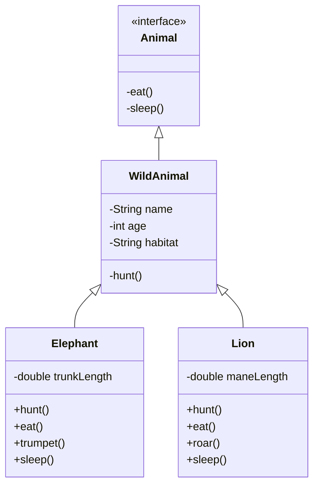

```mermaid
classDiagram
Animal <|-- WildAnimal
WildAnimal <|-- Elephant
WildAnimal <|-- Lion
class Animal{
<<interface>>
-eat()
-sleep()
}
class Elephant{
-double trunkLength
+hunt()
+eat()
+trumpet()
+sleep()
}
class Lion{
-double maneLength
+hunt()
+eat()
+roar()
+sleep()
}
class WildAnimal{
-String name
-int age
-String habitat
-hunt()
}

```