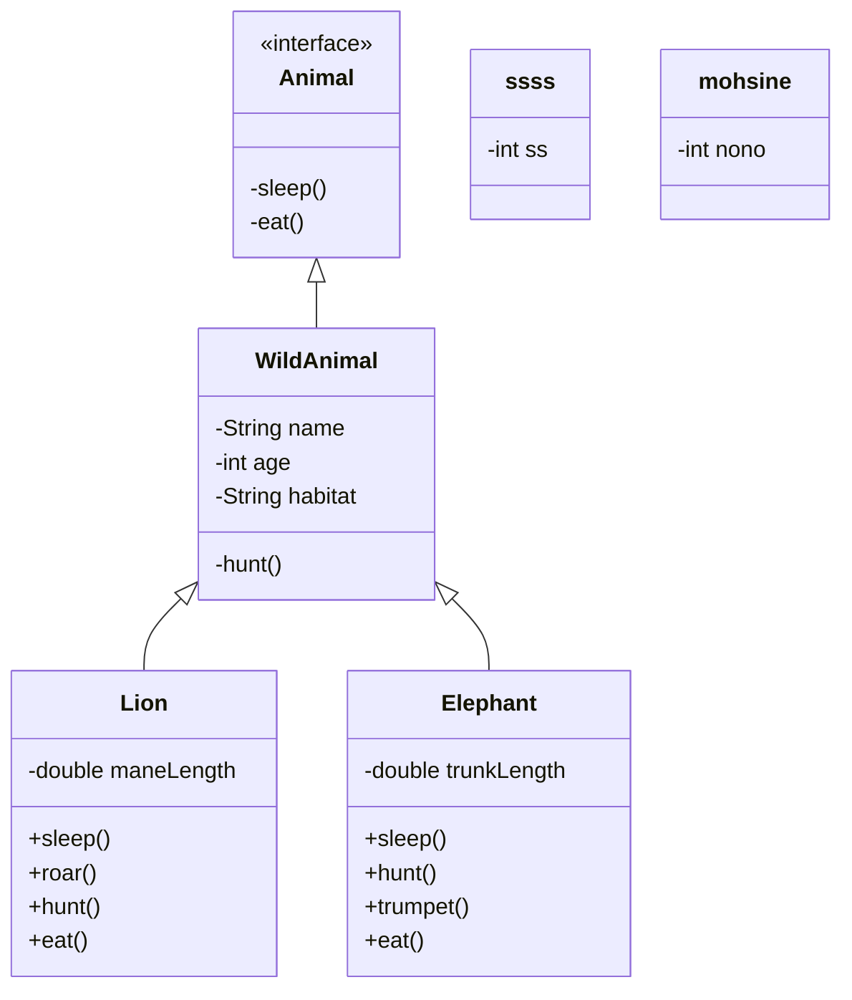

```mermaid
classDiagram
Animal <|-- WildAnimal
WildAnimal <|-- Lion
WildAnimal <|-- Elephant
class ssss{
-int ss
}
class Animal{
<<interface>>
-sleep()
-eat()
}
class Lion{
-double maneLength
+sleep()
+roar()
+hunt()
+eat()
}
class Elephant{
-double trunkLength
+sleep()
+hunt()
+trumpet()
+eat()
}
class WildAnimal{
-String name
-int age
-String habitat
-hunt()
}
class mohsine{
-int nono
}

```