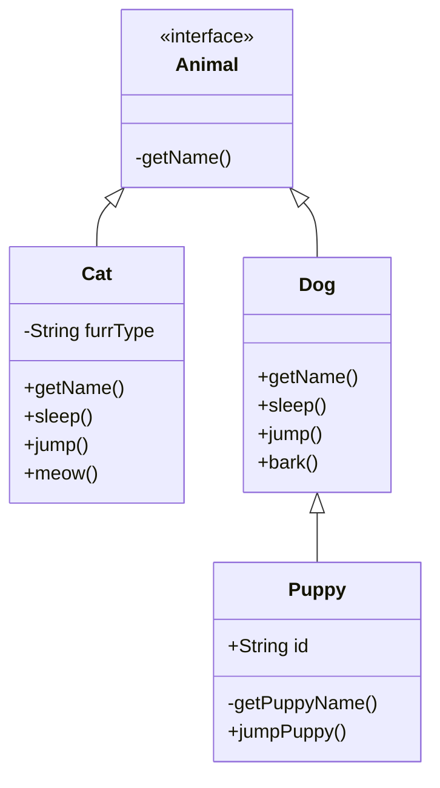

```mermaid
classDiagram
Animal <|-- Cat
Animal <|-- Dog
Dog <|-- Puppy
class Cat{
-String furrType
+getName()
+sleep()
+jump()
+meow()
}
class Puppy{
+String id
-getPuppyName()
+jumpPuppy()
}
class Dog{
+getName()
+sleep()
+jump()
+bark()
}
class Animal{
<<interface>>
-getName()
}

```